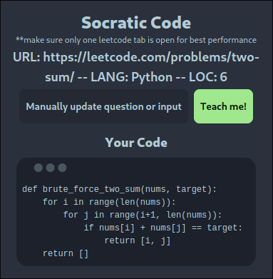
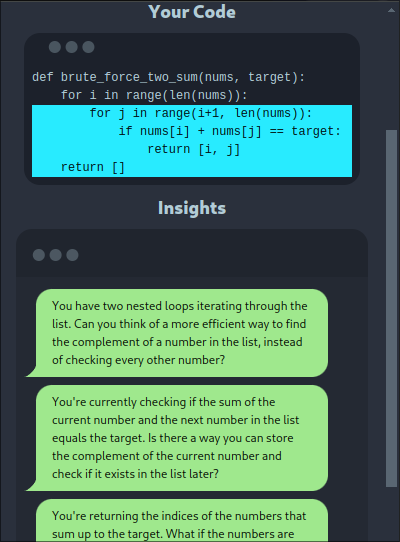
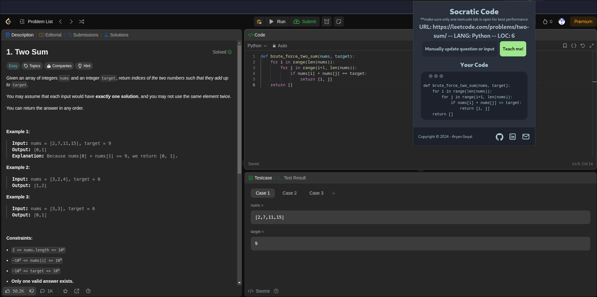
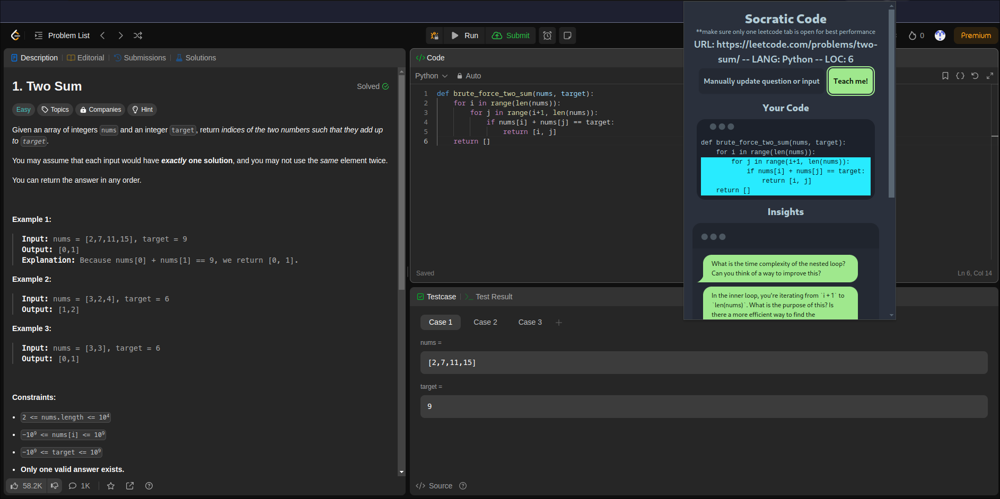
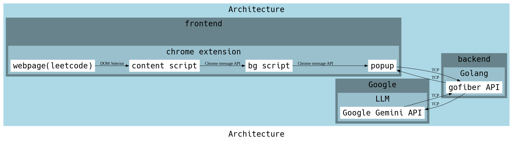

# Socratic Leetcode

This chrome extension helps you to solve leetcode questions on your own by providing insightful questions according to the socratic teaching philosophy

> project made for devfolio's "GenAI Exchange Hackathon by Google"

- [Installation](#installation)
- [Description](#description)
  - [In Scope](#in-scope)
  - [Out of Scope](#out-of-scope)
  - [Future Opportunities](#future-opportunities)
- [Challenges](#challenges)
  - [Site Data Pipeline](#site-data-pipeline)
  - [CI](#ci)
- [Working](#working)
- [Architecture](#architecture)

## Installation

1. Download the package `socratic-code.zip` from Releases

2. Extract it

   ```bash
   # USE unzip
   unzip socratic-code.zip
   # OR USING 7z
   7z x socratic-code.zip
   ```

3. Open chrome, go to `chrome://extensions/` and enable developer mode

4. Click on Load unpacked and navigate to the `build` folder you just extracted

## Description

This project aims to create a reliable teaching assistant for Data Structures and Algorithms questions. The project is further narrowed down to create an assistant for Leetcode, which is the most popular website for interview and DSA prep. It is deployed as a Chrome Browser Extension.

This teaching assistant will never tell the user the answer completely, as it is based on the Socratic teaching method, in which the teacher asks insightful questions to guide the pupil towards the answer instead of telling them the answer.

### In Scope

- Creating a teaching assistant that guides the user towards figuring out a leetcode problem by themselves
- Accurate and reliable information

### Out of Scope

- Solving the question or running the code that the user inputs is out of scope for this project

### Future Opportunities

- Creating a problem database for easy identifification of the problem. This can be a simple KV with `problem name`->`problem description`
- Creating a solution vector database for these problems, which can be used to give more context to the LLM and perform RAG(Retreival Augmented Generation)
- After implementing RAG, a point based system for monetizing the extension can be developed. Eg. User tops up 5000 coins. 10 coins can generate, say, 2 insightful questions for the given problem

## Challenges

### Site Data Pipeline

It was quite hard to get the input data of the leetcode website. This is because chrome runs the content scripts of the extension in a secluded environment which doesnot have the the properties of the `window` element in the webpage.

The code editor input that leetcode uses is called `monaco`, and we can easily get the input data in correct formatting by entering `window.monaco.editor.getModels()[0].getValue()` in the leetcode website. But this was not the case for the extension, as it doesnot have the properties of `window` element.

Although we can get the properties of this `window` element by using the `"MAIN"` `WORLD` in the content script, it is then not possible to send this data to the outside environment due to security reasons.

This was solved by identifying the correct elements and selecting them with `document.querySelector()`

### CI

Due to my inexperience with Continuous Integration, it took me quite a lot to set it up.

This includes:

1. The chrome extension CI, which is a github workflow to build the extension using `pnpm` and releasing it with github Releases
2. The backend CI, which is a github workflow for publishing the backend service as a docker image on the `ghcr` registry, or Github's docker registry

## Working

The following images represesnt the working of the extension

<p align="center">
    
    
</p>

<p align="center">
    
    
</p>

## Architecture

<p align="center">
    
</p>
